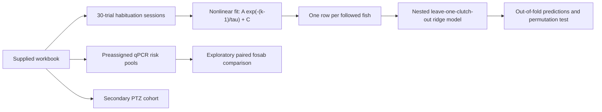
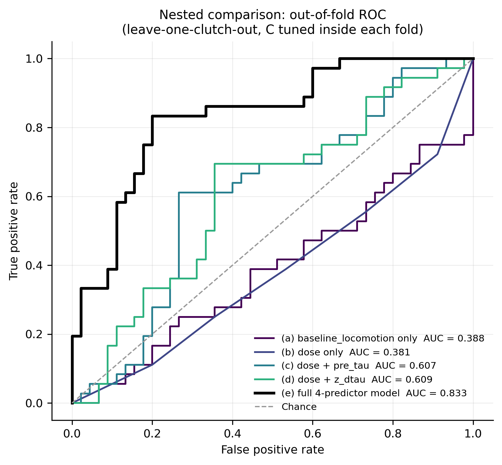

# Acute Visual-Habituation Kinetics as a Candidate Predictor of Later Seizure-Like Activity

**A reproducible analysis of a supplied larval zebrafish pressure-wave-injury dataset**

> [!IMPORTANT]
> This repository verifies the **computational analysis**, not the experimental provenance.
> An author-supplied experimental protocol is now included, but the workbook does not include source
> videos, pressure traces, qPCR Ct exports, the dated protocol, a reproducible outcome-labeling rule,
> or approval identifiers. Until those primary records are added, results should be described as
> findings **in the supplied dataset**, not as an independently authenticated animal experiment or a
> validated clinical biomarker. See
> [data provenance](docs/data-provenance.md).

## Project in one paragraph

Post-traumatic epilepsy can emerge after an apparently seizure-free interval, creating a need for
early experimental markers of later abnormal activity. This project asks whether the rate at which
larval zebrafish reduce their response across repeated visual dark flashes carries predictive
information after syringe pressure-wave exposure. For each fish-session, the pipeline fits an
exponential habituation curve and extracts the decay constant, tau. A four-feature ridge logistic model combines
pre-injury tau, changes at 0.5 and 24 hours, and dose group. Model selection is nested inside
leave-one-clutch-out cross-validation. In 81 complete pressure-wave-exposed fish, the model reached
a pooled out-of-fold AUC of **0.833** and **76.5% accuracy**; a within-clutch permutation test gave
**p = 0.001**. These results support an internally cross-validated association with the workbook's
later behavioral `converted` label. They do not establish electrographic epilepsy, causality,
prospective performance, or human clinical validity.

## Research question

Among pressure-wave-exposed larvae in the supplied workbook, do pre-injury visual-habituation kinetics and
acute within-fish changes classify the binary 6-dpf `converted` label across held-out clutches?

### Analysis hypotheses

1. Pre-injury tau and changes at 0.5 and 24 hours jointly contain out-of-clutch predictive signal.
2. The full model performs better than restricted models using locomotion, dose, baseline tau, or
   post-injury changes alone.
3. Supplied high-risk qPCR pools show exploratory molecular concordance through higher
   `fosab` expression than paired low-risk pools.

These are analysis hypotheses reconstructed from the repository. No preregistration or original
pre-experiment research plan is included.

## Study design represented in the workbook

| Cohort | Records | Role in this repository |
|---|---:|---|
| Longitudinal `fish_*` | 133 fish; 650 sessions; 19,500 trials | Habituation fitting and 6-dpf outcome analysis |
| Primary prediction set | 81 complete injured fish; 36 positive labels | Nested cross-validation; 7 injured fish excluded for missing required sessions |
| Molecular `cf_*` | 86 fish; 249 sessions | Separate behavioral cohort; 72 fish appear in 18 four-fish qPCR pools |
| PTZ `ptz_*` | 34 fish | Secondary, underpowered seizure-threshold probe |

The three ID prefixes do not overlap, so the workbook represents **253 unique animal identifiers**,
not 133 total animals. Fourteen `cf_*` fish are not included in a qPCR pool; the selection procedure
is not documented.



## Experimental methods now documented

The supplied protocol identifies wild-type AB zebrafish, a 14:10-hour light:dark cycle at 28.5 °C,
a syringe pressure-wave injury procedure, and a custom 60-frames-per-second infrared rig. Each
habituation session used 30 one-second dark flashes separated by 15 seconds. It also describes
randomization, blinded video scoring, outcome recording, tissue preservation, `fosab`/`rpl13a`
qPCR, and the 2.5-mM PTZ challenge.

The current reconciled methods record is in
[experimental methods](docs/experimental-methods.md). It distinguishes those author-supplied
details from the data-visible design because the narrative and workbook differ on target sample
size, recorded timepoints, pressure variables, outcome derivation, qPCR pooling, and PTZ cohort
structure. The executable analysis always follows the canonical workbook.

## Main results

| Measurement | Result | Interpretation boundary |
|---|---:|---|
| Habituation fits | 650/650 converged; median R-squared 0.796 | One fit reached a parameter bound |
| Mean leave-one-clutch-out AUC | 0.849; fold range 0.758-0.909 | Only three outer folds |
| Pooled out-of-fold AUC | **0.833**; interval 0.736-0.916 | Interval resamples fish within observed clutches and holds predictions fixed |
| Accuracy at threshold 0.50 | **62/81 = 76.5%** | Sensitivity 66.7%; specificity 84.4% |
| Conditional permutation test | **p = 0.001**; 1,000 shuffles | Labels shuffled within clutch; does not address post-hoc feature selection |
| qPCR high/low ratio | 1.275; nominal log2 paired p = 0.029 | Clutch-averaged log2 sensitivity p = 0.104; risk bins and raw Ct/QC data are absent |
| PTZ group comparison | chi-square p = 0.0849; n = 34 | Underpowered directional check; no conclusion rests on it |

The detailed, machine-generated report is in [RESULTS.md](RESULTS.md), and every reported statistic
is recorded in [results/all_statistics.csv](results/all_statistics.csv).



## What is strong here

- The decay feature is rebuilt from all 19,500 trial rows with explicit fit diagnostics.
- The outer split holds out whole clutches rather than randomly mixing clutch labels across folds.
- Penalty selection occurs only inside each outer training fold.
- The permutation test reruns the nested analysis after shuffling labels within clutch.
- Results, intermediate tables, figures, and a statistic ledger are generated by one command.
- Limitations and secondary analyses are separated from the primary predictive result.

## What remains unresolved

- `converted` is loaded from the workbook; the observation duration, threshold, blinded scoring
  procedure, and adjudication rules are not provided. Burst-rate values overlap between labels.
- The outcome is behavioral and has no electrographic confirmation in this repository.
- Three clutches are not an external validation cohort, and the confidence interval does not capture
  between-clutch sampling uncertainty or model-refitting uncertainty.
- Dose is an additive feature combined with dose-conditioned scaling; the current model contains no
  formal dose-by-change interaction and should not be described as a moderation analysis.
- qPCR risk-bin assignment and pool selection are not regenerated by code. Raw Ct values, technical
  replicates, primer efficiencies, and quality-control records are absent.
- The experimental protocol is now documented, but primary acquisition files, student/laboratory
  contributions, provenance, safety review, and approval status still require supporting records.

## Reproduce the analysis

Tested environment: Python 3.14.4. For the closest numerical reproduction, install the exact tested
environment in `requirements-tested.txt`.

```bash
python -m venv .venv
# Windows: .venv\Scripts\activate
# macOS/Linux: source .venv/bin/activate
pip install -r requirements-tested.txt
python run_all.py
pytest
```

Useful options:

```bash
python run_all.py --permutations 200
python run_all.py --skip-permutation
python run_all.py --seed 123
```

The canonical workbook is
[`data/raw/behavioral_pte_source.xlsx`](data/raw/behavioral_pte_source.xlsx). Its checksum, sheet
schema, and row counts are recorded in [`data/manifest.json`](data/manifest.json). Derived tables are
CSV, figures are 300-dpi PNG, and narrative artifacts are Markdown; see
[file conventions](docs/file-conventions.md).

## Repository map

```text
ABSTRACT.md                       under-300-word AAN Neuroscience Research Prize abstract
data/
  raw/behavioral_pte_source.xlsx  immutable supplied workbook
  manifest.json                   checksum and sheet-level data contract
  README.md                       source-data handling notes
docs/
  data-dictionary.md              fields, units, and unresolved definitions
  data-provenance.md              what is known, missing, and required to authenticate the data
  experimental-methods.md         supplied experimental protocol reconciled to the workbook
  file-conventions.md             canonical and derived file formats
  methods-and-analysis.md         reproducible computational methods and documentation status
  ai-use-disclosure.md            transparent record of AI assistance
results/
  figures/                        generated figures
  tables/                         generated analysis-ready CSV tables
  all_statistics.csv              machine-readable statistics ledger
src/                              analysis, modeling, plotting, and report generation
tests/                            focused data-contract and pipeline tests
run_all.py                        end-to-end runner
RESULTS.md                        generated detailed report
```

## AAN Neuroscience Research Prize abstract

The [competition abstract](ABSTRACT.md) follows the concise narrative progression of the supplied
examples: neurological need, assay design, quantitative validation, orthogonal molecular result,
limitation, and impact. Its body is below the
[AAN Neuroscience Research Prize](https://www.aan.com/research/neuroscience-research-prize)
300-word maximum. The AAN requires the application to be the applicant's original written work, so
the student must verify every claim and revise this draft into their own voice before submission.

## Scope-appropriate conclusion

Within the supplied dataset, a compact model of baseline and acute visual-habituation kinetics
separates later behavioral outcome labels across three held-out clutches better than chance. The work
is a promising **candidate-assay analysis** that now needs authenticated provenance, a reproducible
outcome definition, prospective clutches, electrographic confirmation, and independently reproducible
molecular methods before it can support a biomarker claim.
