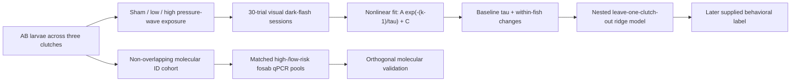

# Acute Visual-Habituation Kinetics as a Candidate Predictor of Later Seizure-Like Activity

**A science project structured around the Regeneron ISEF judging rubric, combining a longitudinal
larval-zebrafish behavioral assay, clutch-aware prediction, and orthogonal molecular validation**

## Project at a glance

| Element | Project contribution |
|---|---|
| Neurological need | Earlier functional indicators are needed during the interval between traumatic brain injury and later seizure-like activity. |
| Central question | Do pre-injury visual-habituation kinetics and acute within-animal changes classify a later seizure-like behavioral label across held-out clutches? |
| Original approach | Fit a 30-trial dark-flash habituation curve at five longitudinal timepoints, then combine baseline and within-fish changes in a clutch-aware prediction model. |
| Primary result | Pooled out-of-fold AUC **0.833** and **76.5% accuracy** in 81 complete injured fish; within-clutch permutation **p = 0.001**. |
| Orthogonal validation | In a separate molecular ID cohort, matched high-risk pools had **1.275-fold `fosab` expression** versus low-risk pools (nominal 95% CI 1.032–1.575; nominal paired log2 **p = 0.029**; clutch-aggregated sensitivity p = 0.104). |
| Potential impact | A rapid, low-cost candidate preclinical assay for prioritizing animals and parameters in prospective post-traumatic epileptogenesis studies. |

> [!IMPORTANT]
> **Evidence boundary.** The computational results are reproducible from the supplied workbook. An
> author-supplied experimental protocol is included, but primary videos, pressure traces, raw qPCR
> Ct/QC exports, the outcome-label audit trail, dated approvals, and contribution records are not
> public in this repository. Claims are therefore limited to the supplied dataset; this is not yet a
> validated clinical biomarker or an independently authenticated animal study. See
> [data provenance](docs/data-provenance.md).

## ISEF science-rubric alignment

This README follows the official
[Regeneron ISEF Grand Award criteria](https://www.societyforscience.org/isef/grand-award/criteria/)
for a **science project**.

| Judging dimension | Points | Evidence made explicit here | Readiness gap |
|---|---:|---|---|
| Research Question | 10 | Focused, testable question; candidate contribution; three hypotheses | Add a student-verified literature gap and identify what was defined before collection |
| Design and Methodology | 15 | Sham/low/high groups, pre-injury baseline, repeated measures, three clutches, matched qPCR pairs | Add original protocol, allocation records, exact injury calibration, and label rule |
| Execution: Data, Analysis, Interpretation | 20 | 19,500 trials, nonlinear fit diagnostics, nested clutch-held validation, permutation test, effect sizes, sensitivity analyses | Add primary acquisition files, prospective replication, and raw qPCR QC |
| Creativity and Potential Impact | 20 | Longitudinal kinetic feature, leakage-controlled model, low-cost rig, and cross-modal validation layer | Demonstrate generalization and electrographic relevance |
| Presentation | 35 | Logical evidence chain, figures, machine-readable statistics, limitations, and proposed next studies | Student must prepare their own compliant poster and defend independence, mechanisms, limitations, and future work |

The rubric places 35 points on presentation: 10 for the poster and 25 for the interview. Judges
explicitly assess understanding of the underlying science, interpretation, limitations,
independence, impact, and future research—not just the headline AUC.

## Background and proposed field contribution

Post-traumatic epilepsy can appear after a latent interval, motivating early experimental measures
that can be collected before later seizure-like activity. This project tests whether longitudinal
visual-habituation kinetics can serve as a rapid preclinical stratification assay and whether a
separate molecular modality supports the supplied risk strata. For an ISEF research plan, poster, or
interview, the student must add a literature gap and bibliography that they personally researched,
verified, cited, and can explain; this repository does not substitute AI-generated citations for
that work.

## Research question and hypotheses

### Research question

Among pressure-wave-exposed larvae in the supplied workbook, do pre-injury visual-habituation
kinetics and acute within-fish changes classify the binary 6-dpf `converted` label across held-out
clutches?

### Hypotheses

1. Pre-injury `tau` and changes at 0.5 and 24 hours jointly contain out-of-clutch predictive signal.
2. The full behavioral model outperforms restricted explanations based on locomotion, injury dose,
   baseline `tau`, or post-injury changes alone.
3. **Orthogonal molecular validation hypothesis:** separately assayed high-risk qPCR pools show
   higher `fosab` expression than group- and clutch-matched low-risk pools.

These analysis hypotheses are reconstructed from the repository. A dated, pre-experiment research
plan or preregistration has not been provided.

## Design and methodology

### Experimental structure represented in the workbook

| Cohort | Records | Experimental unit | Role |
|---|---:|---|---|
| Longitudinal `fish_*` | 133 IDs; 650 sessions; 19,500 trials | Individual larva | Habituation fitting and later behavioral outcome |
| Primary prediction set | 81 complete injured fish; 36 positive labels | Individual larva | Nested leave-one-clutch-out validation; 7 injured fish lacked required sessions |
| Molecular `cf_*` | 86 non-overlapping IDs; 249 sessions | Four-larva qPCR pool | Orthogonal molecular validation; 72 larvae form 18 pools and 9 matched pairs |
| PTZ `ptz_*` | 34 non-overlapping IDs | Individual larva | Secondary, underpowered seizure-susceptibility probe |

The three ID namespaces do not overlap and represent 253 unique identifiers. Fourteen `cf_*` larvae
are not listed in a qPCR pool, and their selection status is not documented.

### Variables, controls, and replication

| Design element | Implementation |
|---|---|
| Independent variables | Sham, low-impact, and high-impact groups; time relative to injury |
| Longitudinal control | Each fish's pre-injury `tau` supplies its own baseline |
| Experimental control | Sham handling group |
| Biological replication/blocking | Three independent clutches collected on separate days |
| Primary predictors | Injury dose, pre-injury `tau`, `delta_tau` at 0.5 h, and `delta_tau` at 24 h |
| Primary response | Supplied later binary `converted` behavioral label |
| Leakage control | Whole-clutch outer test folds; preprocessing and penalty selection fitted inside training data |
| Orthogonal readout | `fosab` qPCR normalized to `rpl13a`, paired within each group × clutch cell |

### Experimental and analytical workflow



The author-supplied protocol identifies wild-type AB zebrafish, a 14:10-hour light:dark cycle at
28.5 °C, a syringe pressure-wave procedure, and a custom 60-frames-per-second infrared rig. Each
session used 30 one-second dark flashes separated by 15 seconds. Full acquisition details and the
documented discrepancies between the narrative and workbook are in
[experimental methods](docs/experimental-methods.md); the executable analysis is in
[methods and analysis](docs/methods-and-analysis.md).

## Results

### 1. Behavioral prediction

| Measurement | Result | Interpretation boundary |
|---|---:|---|
| Habituation fits | 650/650 converged; median R-squared 0.796 | One fit reached a parameter bound |
| Mean leave-one-clutch-out AUC | 0.849; fold range 0.758–0.909 | Three outer folds |
| Pooled out-of-fold AUC | **0.833**; conditional interval 0.736–0.916 | Interval holds predictions fixed and resamples fish within observed clutches |
| Accuracy at threshold 0.50 | **62/81 = 76.5%** | Sensitivity 66.7%; specificity 84.4% |
| Conditional permutation test | **p = 0.001**; 1,000 shuffles | Labels shuffled within clutch and nested validation rerun |
| Dose-blind behavior model | Mean-fold AUC **0.810**; pooled out-of-fold AUC **0.801** | Behavioral predictors retain signal without explicit dose encoding |

At 0.5 hours, low- and high-impact injury produced opposing shifts in `tau` (+3.74 versus −2.72
trials; Cohen's d = 2.19, p < 0.0001). This dose-dependent direction is why the full model preserves
group context, while the dose-blind ablation tests whether behavior carries information without the
explicit dose term.


**Figure 1. Clutch-held behavioral prediction.** ROC curves show out-of-fold performance for nested
leave-one-clutch-out models in 81 complete injured fish; all AUC values in the legend are pooled
out-of-fold values. The full four-feature model reached AUC 0.833, and the dose-blind behavioral
model reached 0.801. In the legend, `pre_tau` is the pre-injury habituation time constant,
`delta_tau` is within-fish change, and `z_dtau` denotes the standardized change features. The
diagonal is chance performance.

### 2. Orthogonal molecular validation: c-fos (`fosab`)

The orthogonal validation asks whether supplied risk strata, described as behavior-derived, also
separate on a different measurement modality: immediate-early-gene expression. The molecular ID
cohort does not enter the prediction model. Eighteen four-larva pools form nine high-/low-risk pairs,
matched within each group × clutch cell.

| Validation result | Value |
|---|---:|
| High-risk / low-risk geometric mean ratio | **1.275** |
| Relative increase in high-risk pools | **27.5%** |
| Nominal 95% CI for ratio | **1.032–1.575** |
| Nominal paired test on log2 fold change | **p = 0.029** |
| Nominal Wilcoxon signed-rank test on log2 differences | **p = 0.027** |
| Clutch-aggregated sensitivity, n = 3 clutches | p = 0.104 |
| Injured-only high/low difference | Mean paired difference 0.391; paired raw-scale p = 0.061 |
| Injured-only direction | 5/6 pairs high-risk > low-risk; exact sign-test p = 0.219 |

This is the project's **orthogonal molecular validation layer**: a separate qPCR modality shows
cross-modal concordance with the supplied risk strata. It is not an external validation
cohort for the prediction model and does not establish electrographic epilepsy. The validation's
precision is limited by three clutches, pooled whole-larva tissue, unavailable raw Ct/QC files, and
an unavailable risk-pool selection rule. Accordingly, orthogonal validation here means cross-modal
concordance within the supplied dataset, not confirmation of the classifier or seizure endpoint.


**Figure 2. Orthogonal c-fos validation.** Left: nine matched high-/low-risk four-larva qPCR pool
pairs, one per group × clutch cell. Right: within-pair high-minus-low differences. The nominal log2
paired test gave p = 0.029; the three-clutch aggregated sensitivity gave p = 0.104.

### 3. Secondary PTZ probe

The separate 34-larva PTZ table is an underpowered directional check. The three-group comparison did
not reach p < 0.05 (chi-square p = 0.0849), so no primary conclusion rests on it.

The complete machine-generated results narrative is in [RESULTS.md](RESULTS.md), and every reported
statistic is recorded in [results/all_statistics.csv](results/all_statistics.csv).

## Execution, statistical rigor, and reproducibility

- All 19,500 trial rows are refit rather than accepting supplied summary parameters.
- Fit convergence, R-squared, RMSE, parameter-bound status, and `tau` uncertainty are recorded.
- The primary outer split holds out whole clutches instead of mixing siblings across train and test.
- Penalty selection and feature scaling occur only inside each training fold.
- The 1,000-permutation null reruns nested validation after within-clutch label shuffling.
- Restricted models test locomotion-only, dose-only, baseline-only, change-only, and dose-blind
  behavioral alternatives.
- The c-fos validation preserves high/low matching within group × clutch cells and reports a
  clutch-aggregated sensitivity analysis.
- One command regenerates the tables, figures, statistics ledger, and detailed report.

## Creativity and potential impact

The project combines four ideas into one evidence chain:

1. **Kinetics instead of a single endpoint:** `tau` measures the decay of repeated visual responses.
2. **Within-animal change:** each fish is compared with its own pre-injury baseline.
3. **Clutch-aware prediction:** whole biological batches are held out during testing.
4. **Orthogonal validation:** a separate molecular assay tests whether supplied risk strata also
   differ in neural-activity-associated gene expression.

The supplied operational log estimates 0.90 operator-minutes and $0.094 in consumables per fish-session.
If prospectively validated, this approach could provide a scalable preclinical screen for selecting
animals, timepoints, or treatment parameters before more expensive electrographic experiments.

## Limitations and next validation steps

- `converted` is loaded from the workbook. The supplied sham-percentile description does not fully
  reproduce the labels, and burst-rate values overlap between classes.
- The endpoint is behavioral and lacks electrographic confirmation.
- Three clutches do not constitute external validation, and current intervals do not capture all
  model-selection or between-clutch uncertainty.
- Injury dose is additive; the model contains no dose-by-change interaction and is not a formal
  moderation analysis.
- The c-fos pool-selection rule and raw Ct, primer, efficiency, and QC records are unavailable.
- Primary videos, pressure traces, exclusions, approvals, and student-versus-mentor contribution
  records remain off-repository or unavailable.

The next decisive study should lock the outcome and risk-pool rules before scoring, preserve raw
video/pressure/Ct files with checksums, add prospectively held-out clutches, correlate continuous
behavioral risk with molecular expression, and confirm outcomes using field-potential or other
electrographic recordings.

## Student contribution and support

ISEF judges score the student's independence and understanding. The repository currently does not
contain a verified contribution statement, so it does not assign the work below to the student,
mentor, laboratory, or software by assumption.

| Contribution area requiring attribution | Current repository status |
|---|---|
| Research question and experimental design | Not attributed |
| Animal husbandry, pressure-wave exposure, behavioral recording, and scoring | Not attributed |
| qPCR collection, wet-lab processing, pooling, and QC | Not attributed |
| Code, statistical plan, interpretation, and figure preparation | AI/code assistance disclosed; individual human roles not attributed |
| Materials, funding, facilities, and other support | Not documented |

Before competition, add a factual student-versus-mentor contribution record and the required support
disclosures. The student should be prepared to explain every method, analysis choice, result,
limitation, and next experiment without relying on this README.

## ISEF documentation and AI-use status

This repository is a reproducibility and interview-preparation artifact, **not an ISEF submission
document**. Under the current
[ISEF rules for all projects](https://www.societyforscience.org/isef/international-rules/rules-for-all-projects/):

- the official abstract is one page, limited to 250 words, and must describe only current-year work
  conducted by the student rather than supervising adults;
- ISEF 2027 permits no more than 12 continuous months of research beginning no earlier than January
  2026; collection dates are absent here, so this repository cannot verify current-year eligibility;
- generative AI may be a project resource only when cited and acknowledged, and may not write the
  ISEF research plan, abstract, poster, or citations;
- student work, outside support, and generative-AI use must be documented, including on the required
  [Student Support Disclosure Form (2A)](https://sspcdn.blob.core.windows.net/files/Documents/SEP/ISEF/2027/Forms/2A-Student-Support-Disclosure-Form.pdf),
  with a prompt-and-response log attached for AI use or, only if unavailable, a summary;
- the pre-experiment research plan must include the rationale; question, hypotheses, or expected
  outcomes; materials; procedures; risk and safety assessment; data analysis; and a student-verified
  bibliography; this repository does not establish that a complete contemporaneous plan existed and
  cannot replace one retroactively;
- official forms and any required SRC/IACUC/other approvals must be completed on the competition's
  required timeline.

Accordingly, [AI_ANALYSIS_SUMMARY.md](AI_ANALYSIS_SUMMARY.md) is retained only as a labeled
AI-generated analysis summary, not an abstract draft. The student must write a new ISEF abstract
independently from a blank page, create the presentation in their own words, and independently
verify and format every citation. AI assistance is documented in
[ai-use disclosure](docs/ai-use-disclosure.md).

The supplied protocol reports that all zebrafish procedures ended before 7 dpf. Current
[ISEF vertebrate-animal rules](https://www.societyforscience.org/isef/international-rules/vertebrate-animals/)
define zebrafish past 7 days (168 hpf) as covered vertebrates. Any live-study phase past 168 hpf
therefore falls under the vertebrate-animal rules; the fair/SRC must determine project
classification and required forms. Exact endpoint times and final disposition require
documentation. Even if every larva ended at or before 168 hpf, adult broodstock involvement,
terminal tissue/qPCR work, PTZ and other chemical use, the research site, and local or RRI rules can
independently require prior review, risk assessment, and forms; see the ISEF
[tissue rules](https://www.societyforscience.org/isef/international-rules/tissue-and-body-fluid/)
and [hazardous-chemical rules](https://www.societyforscience.org/isef/international-rules/hazardous-chemicals-activities-or-devices/).
Written fair/SRC classification is still required; this README does not claim ISEF compliance.

## Reproduce the analysis

Tested environment: Python 3.14.4. For the closest numerical reproduction, install the exact tested
environment in `requirements-tested.txt`.

```bash
python -m venv .venv
# Windows: .venv\Scripts\activate
# macOS/Linux: source .venv/bin/activate
pip install -r requirements-tested.txt
python run_all.py
pytest
```

Useful options:

```bash
python run_all.py --permutations 200
python run_all.py --skip-permutation
python run_all.py --seed 123
```

The canonical workbook is
[`data/raw/behavioral_pte_source.xlsx`](data/raw/behavioral_pte_source.xlsx). Its checksum, schema,
and row counts are recorded in [`data/manifest.json`](data/manifest.json). Derived tables are CSV,
figures are 300-dpi PNG, and narrative artifacts are Markdown; see
[file conventions](docs/file-conventions.md).

## Repository map

```text
AI_ANALYSIS_SUMMARY.md            labeled AI-generated summary; not an abstract draft
data/
  raw/behavioral_pte_source.xlsx  immutable supplied workbook
  manifest.json                   checksum and sheet-level data contract
  README.md                       source-data handling notes
docs/
  data-dictionary.md              fields, units, and unresolved definitions
  data-provenance.md              evidence status and authentication requirements
  experimental-methods.md         supplied protocol reconciled to the workbook
  methods-and-analysis.md         reproducible computational methods
  ai-use-disclosure.md            transparent record of AI assistance
results/
  figures/                        generated 300-dpi figures
  tables/                         generated analysis-ready tables
  all_statistics.csv              machine-readable statistics ledger
src/                              analysis, modeling, plotting, and report generation
tests/                            data-contract and pipeline tests
run_all.py                        end-to-end runner
RESULTS.md                        generated detailed report
```

## Scope-appropriate conclusion

Within the supplied dataset, baseline and acute visual-habituation kinetics classify a later
behavioral label across held-out clutches better than chance. The separate c-fos experiment provides
orthogonal molecular validation of the supplied risk stratification through higher `fosab`
expression in matched high-risk pools; it is not external validation of the classifier or epilepsy
endpoint. The project now needs primary-record authentication, locked label and pool-selection
rules, prospective clutches, and electrographic confirmation before the assay can support a
biomarker claim.
