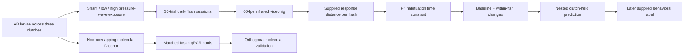
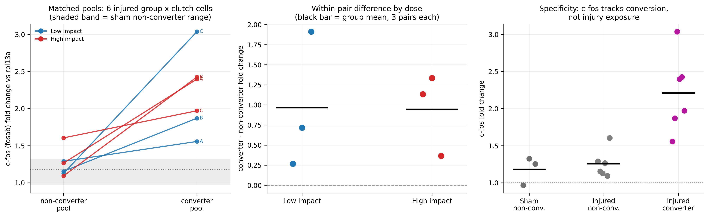

# Acute Visual-Habituation Kinetics as a Candidate Predictor of Later Seizure-Like Activity

**A longitudinal larval-zebrafish study combining pressure-wave injury, 60-fps infrared video
tracking, dark-flash habituation, clutch-aware prediction, and orthogonal molecular validation.**

[Methods](docs/experimental-methods.md) ·
[Analysis](docs/methods-and-analysis.md) ·
[Full results](RESULTS.md) ·
[Data provenance](docs/data-provenance.md) ·
[Reproduce](#reproduce-the-analysis)

## Project overview

Post-traumatic epilepsy can emerge after a latent period, when early functional changes may already
be present but difficult to measure at scale. This project tests whether the **shape of visual
habituation over time**—not just a single startle response—contains information about later
seizure-like behavior.

Larval zebrafish were followed before and after pressure-wave exposure using an author-described,
custom top-down infrared video rig intended for whole-animal centroid tracking. The analysis begins
with supplied flash-evoked response distances and converts each 30-trial series into a habituation
time constant, `tau`. Baseline `tau` and acute within-fish changes were then evaluated in a
leakage-controlled, clutch-held prediction pipeline. A separate c-fos qPCR experiment tested whether
supplied risk strata, described as behavior-derived, also separated on an orthogonal molecular
readout.

| Highlight | Result |
|---|---|
| Longitudinal cohort | **133 larvae** · **650 sessions** · **19,500 trials** |
| Behavioral prediction | Pooled out-of-fold AUC **0.833** · accuracy **76.5%** · permutation **p = 0.001** |
| Orthogonal molecular validation | High-risk pools showed **1.275× `fosab` expression** · nominal paired log2 **p = 0.029** · clutch sensitivity **p = 0.104** |
| Operational estimate | **0.90 operator-minutes** and **$0.094** per fish-session |

> [!NOTE]
> The repository reproduces the computational analysis from the canonical workbook. Primary videos,
> pressure traces, raw qPCR Ct/QC exports, exact outcome-label records, dated approvals, and complete
> contribution records are not included. Results therefore describe the supplied dataset and do not
> establish a clinical biomarker or electrographically confirmed epilepsy.

## Research question

Among pressure-wave-exposed larvae, do pre-injury visual-habituation kinetics and acute within-fish
changes classify a supplied later seizure-like behavioral label across held-out clutches?

The study evaluates three linked predictions:

1. Baseline `tau` and changes at 0.5 and 24 hours contain out-of-clutch predictive information.
2. Behavior contributes information beyond locomotion, injury dose, or either timepoint alone.
3. Supplied high-risk qPCR pools show higher `fosab` expression than group- and clutch-matched
   low-risk pools, providing orthogonal molecular validation of the risk stratification.

## Study design

| Cohort | Scale | Role |
|---|---:|---|
| Longitudinal behavior | 133 IDs; 650 sessions | Habituation fitting and later behavioral outcome |
| Primary prediction set | 81 complete injured fish; 36 positive labels | Nested leave-one-clutch-out validation |
| Molecular ID cohort | 86 non-overlapping IDs; 72 larvae in 18 four-larva pools | Nine matched high-/low-risk c-fos pairs |
| PTZ cohort | 34 non-overlapping IDs | Secondary seizure-susceptibility probe |

The design includes sham, low-impact, and high-impact groups across three clutches. Each fish provides
its own pre-injury baseline, while whole clutches—not individual siblings—are held out during model
evaluation.



## Methods

### Behavioral tracking and visual-habituation analysis

The author-supplied protocol describes wild-type AB zebrafish maintained at 28.5 °C on a 14:10-hour
light:dark cycle. Behavior was recorded with an **author-described custom Raspberry Pi–based,
infrared-backlit dark-flash video rig intended for whole-animal centroid tracking**. The repository
analyzes the supplied trial-level response distances; it does not process raw video frames.

| Recording/tracking component | Author-described setup or supplied input |
|---|---|
| Camera | Raspberry Pi NoIR Camera Module v2 (Sony IMX219) controlled by a Raspberry Pi 4 Model B |
| Acquisition | 1280 × 720 pixels at 60 frames/s; camera mounted 240 mm above a 96-well plate |
| Spatial scale | Approximately 10 pixels/mm across the plate footprint |
| Tracking contrast | 850-nm infrared backlighting produced dark larval silhouettes on a bright field |
| Stimulus synchronization | An in-frame red indicator LED marked dark-flash onset at frame-level resolution |
| Behavioral input to this analysis | Supplied response distance in millimeters per flash, described as centroid-derived |

The behavioral paradigm is **repeated-trial visual startle-habituation analysis**. Each session
included baseline spontaneous-locomotion recording followed by 30 one-second dark flashes separated
by 15 seconds. Sessions occurred before injury and at 0.5, 1, 5, and 24 hours afterward.

Each response series was fit as:

```text
response(k) = A × exp(-(k - 1) / tau) + C
```

`tau` is the habituation time constant. A larger value indicates slower decay across repeated
stimuli; a smaller value indicates faster habituation.

The canonical workbook begins with derived `distance_mm` and `responded` values. Raw videos,
tracking code, the exact post-flash response window, the centroid-extraction implementation, and the
response threshold are not included. The repository therefore reproduces the habituation-curve and
prediction analyses, but it cannot reconstruct the original video-to-distance tracking step.

### Prediction model

The primary L2-regularized logistic model uses four inputs:

- injury dose;
- pre-injury `tau`;
- within-fish change in `tau` at 0.5 hours; and
- within-fish change in `tau` at 24 hours.

Model selection and feature scaling occur inside the training data. The outer evaluation holds out
one complete clutch at a time, and the conditional permutation test shuffles labels within clutch
before rerunning nested validation.

### Orthogonal molecular validation

The molecular analysis uses `fosab`, the zebrafish c-fos orthologue, normalized to `rpl13a` by the
recorded 2^-ΔΔCt workflow. Eighteen four-larva pools form nine supplied high-/low-risk pairs, one per
group × clutch cell. Paired analyses are performed on fold change and log2 fold change, followed by
a sensitivity analysis that averages the three group-pair differences within each clutch.

Full acquisition details, computational procedures, and documented protocol–workbook discrepancies
are provided in [experimental methods](docs/experimental-methods.md) and
[methods and analysis](docs/methods-and-analysis.md).

## Results

### Behavioral kinetics and prediction

All 650 habituation sessions converged, with a median R-squared of 0.796. At 0.5 hours, low- and
high-impact groups shifted in opposite directions: mean `delta_tau` was +3.74 versus −2.72 trials
(Cohen's d = 2.19, p < 0.0001).

| Metric | Result |
|---|---:|
| Mean leave-one-clutch-out AUC | **0.849** |
| Pooled out-of-fold AUC | **0.833** |
| Conditional AUC interval | 0.736–0.916 |
| Accuracy at threshold 0.50 | **62/81 = 76.5%** |
| Sensitivity / specificity | 66.7% / 84.4% |
| Within-clutch permutation test | **p = 0.001**, 1,000 shuffles |
| Dose-blind behavioral model | Mean-fold AUC **0.810**; pooled AUC **0.801** |


**Figure 1. Clutch-held behavioral prediction.** Curves show pooled out-of-fold performance for
nested leave-one-clutch-out models in 81 complete injured fish. The full model reached AUC 0.833;
the dose-blind baseline-plus-change model reached 0.801. `pre_tau` denotes the pre-injury time
constant, `delta_tau` denotes within-fish change, and the diagonal represents chance performance.

### Orthogonal molecular validation

The separate molecular ID cohort tests the supplied risk stratification using a different assay
modality. Across nine group- and clutch-matched pairs, high-risk pools showed 27.5% higher `fosab`
expression than low-risk pools.

| Validation result | Value |
|---|---:|
| High-risk / low-risk geometric mean ratio | **1.275** |
| Nominal 95% CI | **1.032–1.575** |
| Nominal paired log2 test | **p = 0.029** |
| Nominal Wilcoxon test on log2 differences | **p = 0.027** |
| Clutch-aggregated sensitivity, n = 3 | p = 0.104 |
| Injured-only paired difference | p = 0.061 |
| Injured-only direction | 5/6 positive; sign-test p = 0.219 |



**Figure 2. Orthogonal c-fos validation.** Left: nine matched high-/low-risk four-larva qPCR pool
pairs. Right: within-pair high-minus-low differences. The nominal nine-pair log2 result was p =
0.029; the three-clutch aggregated sensitivity was p = 0.104.

This is **orthogonal molecular validation of the supplied risk stratification**: the qPCR result
provides cross-modal concordance, but it is not an external validation cohort for the classifier and
does not establish electrographic epilepsy. Precision is limited by three clutches, pooled
whole-larva tissue, unavailable raw Ct/QC files, and an unavailable risk-pool selection rule.

### Secondary PTZ probe

The separate 34-larva PTZ comparison was underpowered and did not reach p < 0.05 (chi-square p =
0.0849). No primary conclusion depends on this result.

Every reported statistic is available in
[results/all_statistics.csv](results/all_statistics.csv), with the complete generated narrative in
[RESULTS.md](RESULTS.md).

## Analysis safeguards

- All 19,500 trial rows are refit instead of accepting supplied curve parameters.
- Fit convergence, uncertainty, goodness of fit, and parameter-bound status are recorded.
- Whole clutches are held out during outer validation.
- Scaling and penalty selection are learned only from the training data.
- The permutation null reruns nested validation after within-clutch label shuffling.
- Restricted models test locomotion-only, dose-only, baseline-only, change-only, and dose-blind
  explanations.
- The c-fos analysis preserves group × clutch matching and reports a clutch-level sensitivity.
- One command regenerates the analysis tables, figures, statistics ledger, and detailed report.

## Interpretation and next steps

The supplied data support a focused conclusion: **baseline and acute visual-habituation kinetics
contain internally cross-validated information about a later seizure-like behavioral label.** The
c-fos result provides orthogonal molecular validation of the supplied risk stratification through a
separate measurement modality.

The study does not yet establish a post-traumatic epilepsy biomarker. The next decisive experiment
should prospectively lock the outcome and molecular-pooling rules, preserve primary video, pressure,
and Ct files, add completely held-out clutches, correlate continuous behavioral risk with molecular
expression, and confirm the endpoint electrophysiologically.

## Reproduce the analysis

The tested environment uses Python 3.14.4. Exact tested package versions are listed in
`requirements-tested.txt`.

```text
python -m venv .venv
```

PowerShell:

```powershell
.\.venv\Scripts\Activate.ps1
```

Windows Command Prompt:

```bat
.venv\Scripts\activate.bat
```

macOS/Linux:

```bash
source .venv/bin/activate
```

Then run:

```text
pip install -r requirements-tested.txt
python run_all.py
pytest
```

Useful options:

```bash
python run_all.py --permutations 200
python run_all.py --skip-permutation
python run_all.py --seed 123
```

The canonical workbook is
[`data/raw/behavioral_pte_source.xlsx`](data/raw/behavioral_pte_source.xlsx). Its checksum, schema,
and row counts are recorded in [`data/manifest.json`](data/manifest.json).

## Transparency

This AI-assisted repository is a reproducibility artifact, not competition-submission text, and it
does not establish competition eligibility or animal-use compliance. Student-versus-mentor roles,
contemporaneous approvals, and exact animal endpoints and final disposition still require factual
documentation. See [data provenance](docs/data-provenance.md),
[data dictionary](docs/data-dictionary.md), and
[AI-use disclosure](docs/ai-use-disclosure.md).

<details>
<summary><strong>Repository guide</strong></summary>

<br>

```text
data/                             canonical workbook, manifest, and source-data notes
docs/                             methods, provenance, field definitions, and AI-use disclosure
results/figures/                  generated 300-dpi figures
results/tables/                   generated analysis-ready tables
results/all_statistics.csv        machine-readable statistics ledger
src/                              analysis, modeling, plotting, and report generation
tests/                            data-contract and pipeline tests
run_all.py                        end-to-end analysis runner
RESULTS.md                        generated detailed results report
AI_ANALYSIS_SUMMARY.md            labeled AI-generated analysis summary; not a submission abstract
```

</details>
